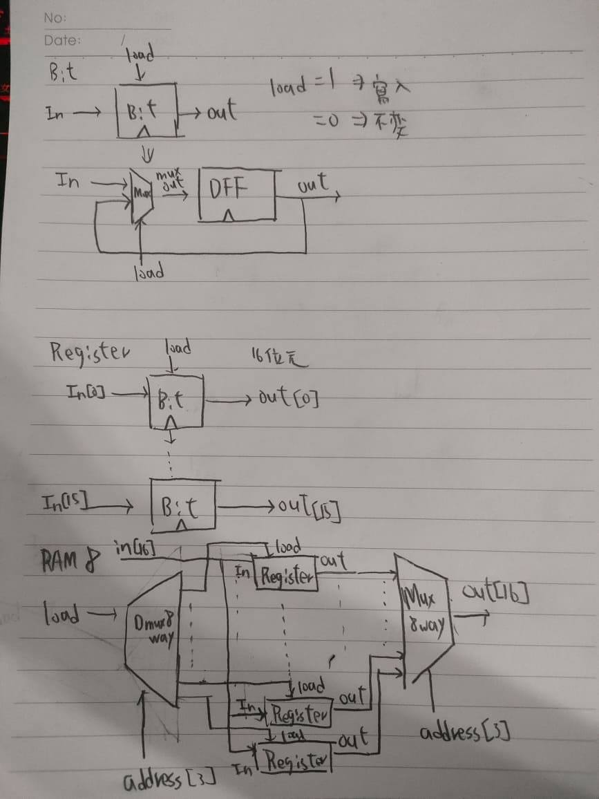

### 1.bit
```{r}
/**
 * 1-bit register:
 * If load[t] == 1 then out[t+1] = in[t]
 *                 else out does not change (out[t+1] = out[t])
 */

CHIP Bit {
    IN in, load;
    OUT out;

    PARTS:
    // Put your code here:
    Mux(a=dffout, b=in, sel=load, out=muxout);
    DFF(in=muxout, out=dffout, out=out);
}
```
### 2.Register
```{r}
**
 * 16-bit register:
 * If load[t] == 1 then out[t+1] = in[t]
 * else out does not change
 */

CHIP Register {
    IN in[16], load;
    OUT out[16];

    PARTS:
    // Put your code here:
    Bit(in=in[0], load=load, out=out[0]);
    Bit(in=in[1], load=load, out=out[1]);
    Bit(in=in[2], load=load, out=out[2]);
    Bit(in=in[3], load=load, out=out[3]);
    Bit(in=in[4], load=load, out=out[4]);
    Bit(in=in[5], load=load, out=out[5]);
    Bit(in=in[6], load=load, out=out[6]);
    Bit(in=in[7], load=load, out=out[7]);
    Bit(in=in[8], load=load, out=out[8]);
    Bit(in=in[9], load=load, out=out[9]);
    Bit(in=in[10], load=load, out=out[10]);
    Bit(in=in[11], load=load, out=out[11]);
    Bit(in=in[12], load=load, out=out[12]);
    Bit(in=in[13], load=load, out=out[13]);
    Bit(in=in[14], load=load, out=out[14]);
    Bit(in=in[15], load=load, out=out[15]);
}
```
### 3.RAM8
```{r}
/**
 * Memory of 8 registers, each 16 bit-wide. Out holds the value
 * stored at the memory location specified by address. If load==1, then 
 * the in value is loaded into the memory location specified by address 
 * (the loaded value will be emitted to out from the next time step onward).
 */

CHIP RAM8 {
    IN in[16], load, address[3];
    OUT out[16];

    PARTS:
    // Put your code here:
    DMux8Way(in=load,sel=address,a=l0,b=l1,c=l2,d=l3,e=l4,f=l5,g=l6,h=l7);
    Register(in=in,load=l0,out=out0);
    Register(in=in,load=l1,out=out1);
    Register(in=in,load=l2,out=out2);
    Register(in=in,load=l3,out=out3);
    Register(in=in,load=l4,out=out4);
    Register(in=in,load=l5,out=out5);
    Register(in=in,load=l6,out=out6);
    Register(in=in,load=l7,out=out7);
    Mux8Way16(a=out0,b=out1,c=out2,d=out3,e=out4,f=out5,g=out6,h=out7,sel=address,out=out);
}
```
 