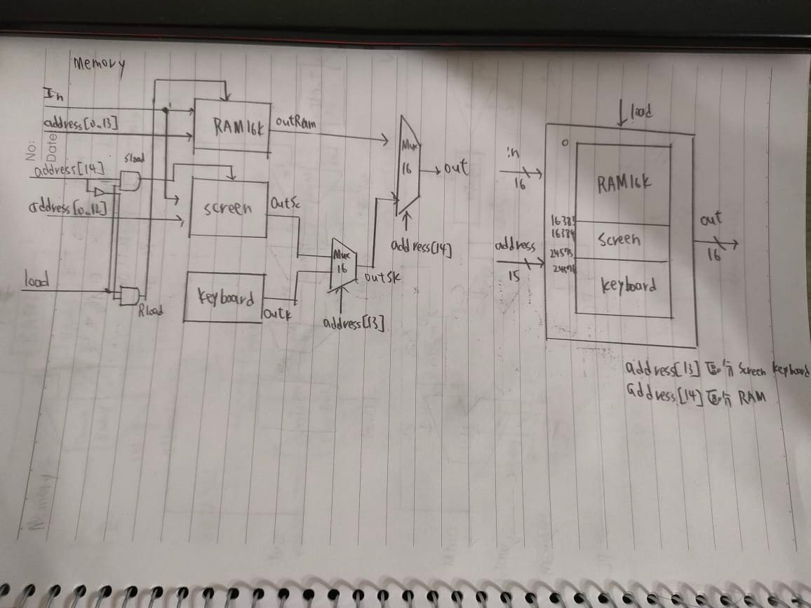
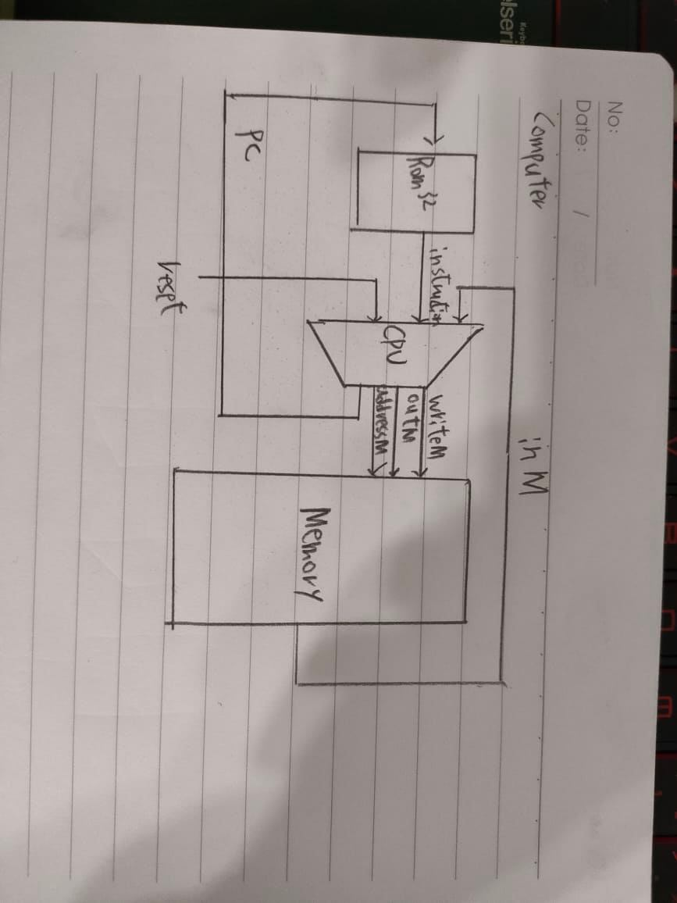

9
### 1.Memory
```{r}
CHIP Memory {
    IN in[16], load, address[15];
    OUT out[16];

    PARTS:
    // Put your code here:
    Not(in=address[14],out=NotA);
    And(a=address[14],b=load,out=Sload);
    And(a=NotA,b=load,out=Rload);

    RAM16K(in=in,address=address[0..13],load=Rload,out=outRam);
    Screen(in=in,address=address[0..12],load=Sload,out=outSc);
    Keyboard(out=outk);

    Mux16(a=outSc,b=outk,sel=address[13],out=outSK);
    Mux16(a=outRam,b=outSK,sel=address[14],out=out);
}
```
### 2.Computer
```{r}
CHIP Computer {

    IN reset;

    PARTS:
    // Put your code here:
    ROM32K(address=pc,out=instruction);
    CPU(inM=inM,instruction=instruction,reset=reset,addressM=addressM,writeM=writeM,outM=outM,pc=pc);
    Memory(in=outM,address=addressM,load=writeM,out=inM);
}

```

 
 